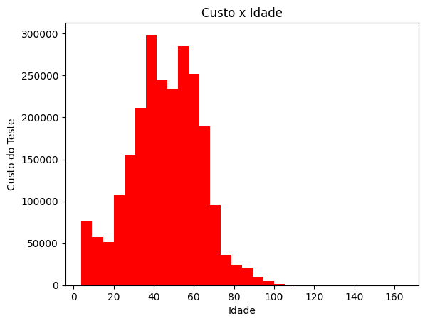

# Desafio Elo Group - EXPANSÃO DE UMA REDE DE LABORATÓRIOS

Este repositório foi criado como parte da resolução do case do processo seletivo da EloGroup para a posição de Cientista de Dados. Recebemos uma base de dados e a tarefa consistia em realizar uma análise exploratória dos dados e justificar a seleção de TRÊS CÓDIGOS POSTAIS (ZIP CODES) para a instalação dos novos laboratórios na rede.

## Tecnologias e Ferramentas utilizadas:

## Metodologia

Para realizar uma análise exploratória da base de dados, utilizei a ferramenta de edição Visual Studio Code (VSCode) e instalei a extensão Jupyter Notebook, juntamente com a biblioteca Pandas na linguagem Python.

### Descrição do Método para a Análise de Dados

- Para a limpeza e tratamento dos dados, adotei diferentes abordagens. Alguns tratamentos simples, como a definição de delimitadores de vírgula, foram realizados diretamente no próprio documento CSV. Outros procedimentos mais complexos foram realizados usando Python, incluindo a remoção de duplicatas, valores ausentes, cálculo de médias, remoção de linhas, transformações de colunas e conversões de tipos de dados, entre outros.

#### Abordagem para resolver o problema

- Foram disponibilizadas cinco bases de dados, incluindo uma tabela de registros de exames. Realizei uma análise visual, utilizando gráficos, para calcular a média de idade dos pacientes e os custos associados aos exames mais frequentemente realizados.

- Após esta análise, realizei duas filtragens: uma na tabela de dados demográficos para extrair os zip codes da população com a média de idade em questão, e outra na tabela de dados econômicos para extrair a renda média da população. Com base nessas informações, foram identificados os zip codes correspondentes a esse perfil populacional.

- Com a filtragem dos zip codes da população com perfil mais propenso a realizar exames laboratoriais frequentes e com renda compatível com os custos dos exames, cruzei essas informações com a lista de zip codes dos laboratórios já existentes na tabela de endereços. O objetivo foi excluir os zip codes correspondentes a laboratórios já estabelecidos. Dessa forma, identifiquei os zip codes mais recorrentes que ainda não foram implantados.

## Resultados
 
 Os zip codes mais recorrentes identificados na tabela foram:

 - 306883
 - 25236
 - 24555

